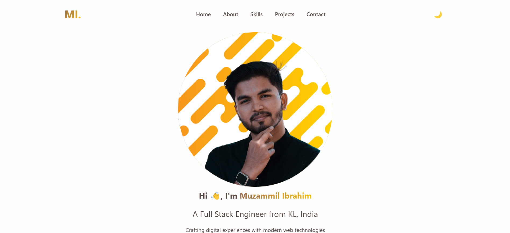

# Muzammil Ibrahim - Portfolio

A modern, responsive portfolio website showcasing my work as a Full Stack Engineer. Built with clean, efficient code and modern web technologies.

## Features

- 🌓 Dark/Light theme switching
- 🎨 Modern UI with smooth animations
- 📱 Fully responsive design
- ⚡ Optimized performance
- 🔍 SEO friendly
- 📊 Project showcase
- 📬 Contact form integration

## Tech Stack

- HTML5
- CSS3 with modern features
- Vanilla JavaScript
- AOS Animations
- Font Awesome Icons

## Live Demo

Visit the live site: [muzammil-13.github.io](https://muzammil-13.github.io)

## Connect With Me

* LinkedIn: [muzammil-ibrahim-pm](command:_cody.vscode.open?%22https%3A%2F%2Flinkedin.com%2Fin%2Fmuzammil-ibrahim-pm%22)
* GitHub: [muzammil-13](command:_cody.vscode.open?%22https%3A%2F%2Fgithub.com%2Fmuzammil-13%22)
* Twitter: [@_muzammil13](command:_cody.vscode.open?%22https%3A%2F%2Ftwitter.com%2F_muzammil13%22)

## License

MIT © Muzammil Ibrahim
